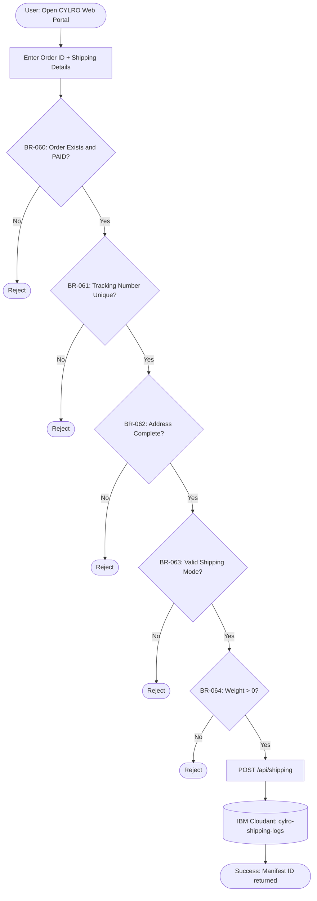

# bob_result/agents/04-workflows.md
# Task 5 — OTN-23: Workflow Reconstruction
# Persona: workflow-reconstructor
# Gate: OTN-10 returned SAFE TO PROCEED
# Date: 2026-08-30

---

## Executive Summary

Workflow reconstruction attempted across all 25 PRG files starting from `MENU.PRG`. **No end-to-end workflow could be reconstructed** from the synthetic stubs — 24/25 files contain no menu navigation, no DO calls, no SAY/GET user interaction, and no traceable control flow.

**One partial workflow** was reconstructed from RESERVA.PRG: a single initialization procedure that performs bulk field writes on the `reserva` work area. This is the only VERIFIED workflow step in the entire snapshot.

The CYLRO PoC workflow (WF-004) is a **PoC-reconstructed workflow** — a modern shipping & delivery flow designed to demonstrate the modernization methodology, informed by the verified constants from RESERVA.PRG and the DBF topology from the 22 DBF filenames.

---

## VERIFIED Workflow Fragment — RESERVA.PRG Initialization

**Workflow ID:** WF-LEGACY-01  
**Entry:** `RESERVA.PRG` → `Reserva_Main` (line 4)  
**Classification:** VERIFIED (partial — no caller chain traceable)

| Step | Action | Source | Classification |
|------|--------|--------|----------------|
| 1 | Open `reserva` work area | `SELECT reserva` — line 4 | VERIFIED |
| 2 | Set Expensa = 10 for all records | `REPLACE ALL Expensa WITH 10` — line 5 | VERIFIED |
| 3 | Set Ult_Mes = 2 for all records | `REPLACE ALL Ult_Mes WITH 2` — line 6 | VERIFIED |
| 4 | Set ult_ano = 1999 for all records | `REPLACE ALL ult_ano WITH 1999` — line 7 | VERIFIED |
| 5 | Return | `RETURN` — line 8 | VERIFIED |

**What cannot be traced:**
- Who calls `Reserva_Main` (caller is UNKNOWN — MENU.PRG is a stub)
- What triggers this initialization (user action? startup? data migration?)
- What happens before or after this procedure
- Whether any user input is accepted at any point

---

## UNKNOWN Workflows

| Workflow | Entry Point | Classification | Reason |
|----------|-------------|----------------|--------|
| Main menu navigation | MENU.PRG | UNKNOWN | Stub — no logic |
| Sub-menu navigation | MENU1.PRG | UNKNOWN | Stub — no logic |
| Payment collection | COBRA.PRG | UNKNOWN | Stub — no logic |
| Account statement | CTACTE.PRG | UNKNOWN | Stub — no logic |
| Liquidation | LIQUIDA.PRG | UNKNOWN | Stub — no logic |
| Receipt generation | RECIBO.PRG | UNKNOWN | Stub — no logic |
| Fee calculation | VALOR.PRG | UNKNOWN | Stub — no logic |
| Annual close | PASANO.PRG | UNKNOWN | Stub — no logic |
| All others (15 PRGs) | Various | UNKNOWN | Stubs — no logic |

---

## WF-004 — CYLRO PoC Shipping & Delivery (RECONSTRUCTED)

> ⚠️ **This workflow is RECONSTRUCTED for the CYLRO PoC. It is NOT legacy-verified.** It demonstrates the modernization methodology using domain-appropriate shipping rules and the IBM Cloudant persistence layer.

**Legacy connection:** The `reserva.dbf` alias and the three verified constants (`Expensa=10`, `Ult_Mes=2`, `ult_ano=1999`) from RESERVA.PRG are the verified anchor points that connect the legacy system to this PoC workflow.
