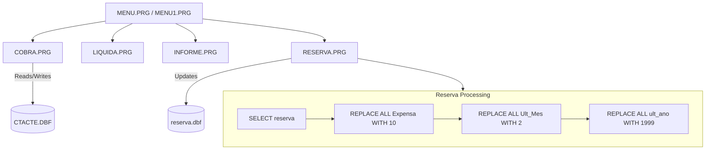

```mermaid
flowchart TD
    MENU[MENU.PRG / MENU1.PRG] --> COBRA[COBRA.PRG]
    MENU --> LIQUIDA[LIQUIDA.PRG]
    MENU --> INFORME[INFORME.PRG]
    MENU --> RESERVA[RESERVA.PRG]
    
    COBRA -->|Reads/Writes| CTACTE[(CTACTE.DBF)]
    RESERVA -->|Updates| RES_DBF[(reserva.dbf)]
    
    subgraph Reserva_Logic [Reserva Processing]
        R1[SELECT reserva]
        R2[REPLACE ALL Expensa WITH 10]
        R3[REPLACE ALL Ult_Mes WITH 2]
        R4[REPLACE ALL ult_ano WITH 1999]
        R1 --> R2 --> R3 --> R4
    end
    
    RESERVA --> Reserva_Logic
```
