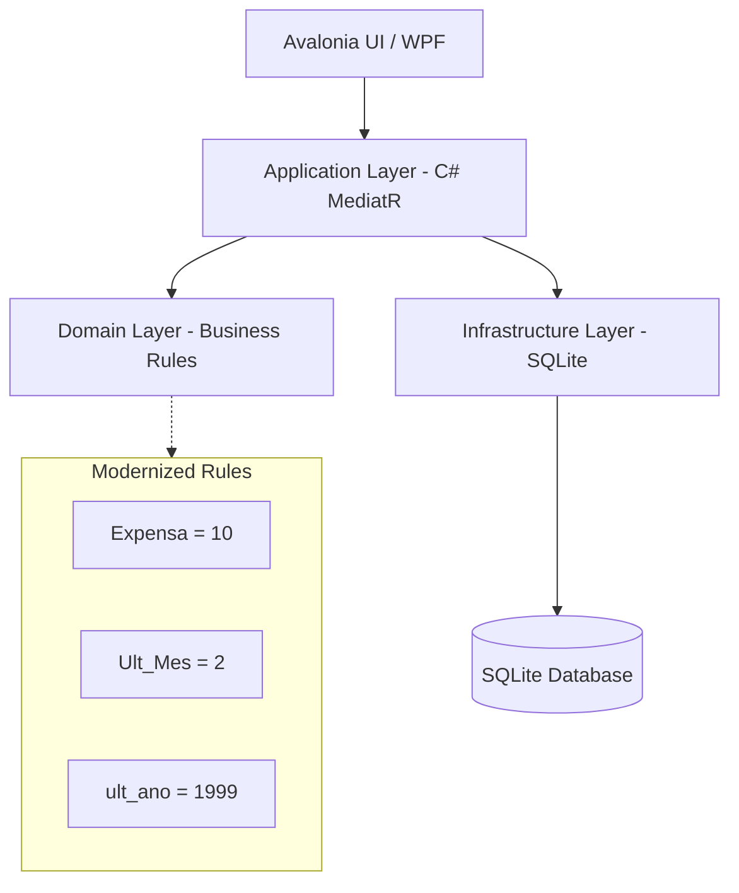

```mermaid
flowchart TD
    UI[Avalonia UI / WPF] --> APP[Application Layer - C# MediatR]
    APP --> DOMAIN[Domain Layer - Business Rules]
    APP --> INFRA[Infrastructure Layer - SQLite]
    
    INFRA --> DB[(SQLite Database)]
    
    subgraph Domain_Rules [Modernized Rules]
        DR1[Expensa = 10]
        DR2[Ult_Mes = 2]
        DR3[ult_ano = 1999]
    end
    
    DOMAIN -.-> Domain_Rules
```
